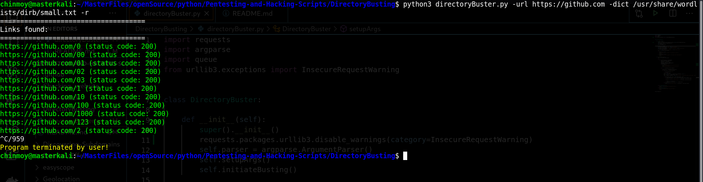

# Directory Busting

A script to bruteforce directories and subdirectories.

## Setp 1

Open Terminal

## Step 2

Traverse to the script location

## Step 3

Run the script as:

`python3 directoryBuster.py -url [URL] -dict [DICTIONARY] -r`

## Usage Details

```
usage: directoryBuster.py [-h] [-dict DICT] [-r] [-p P] [-t T] [-url URL] [-v]

optional arguments:
  -h, --help  show this help message and exit
  -dict DICT  Dictionary to use
  -r          Be recursive
  -p P        Number of parallel directories to bruteforce
  -t T        Number of Threads to bust each directory
  -url URL    Url to bust
  -v          Show all url attempts      Show all url attempts
```

## Example Image


