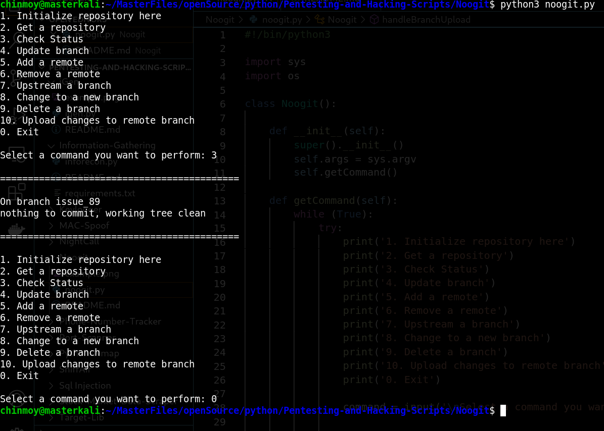

# Git Utility script (Noogit)

A git utility script to use basic git functionality without using any commands.

## Setp 1

Open Terminal

## Step 2

Traverse to the script location

## Step 3

Run the script as:

`python3 noogit.py`

## Usage Details

Here is a list of all the commands Noogit can carry out.

1. Initialize repository here
2. Get a repository
3. Check Status
4. Update branch
5. Add a remote
6. Remove a remote
7. Upstream a branch
8. Change to a new branch
9. Delete a branch
10. Upload changes to remote branch

## Example Image

