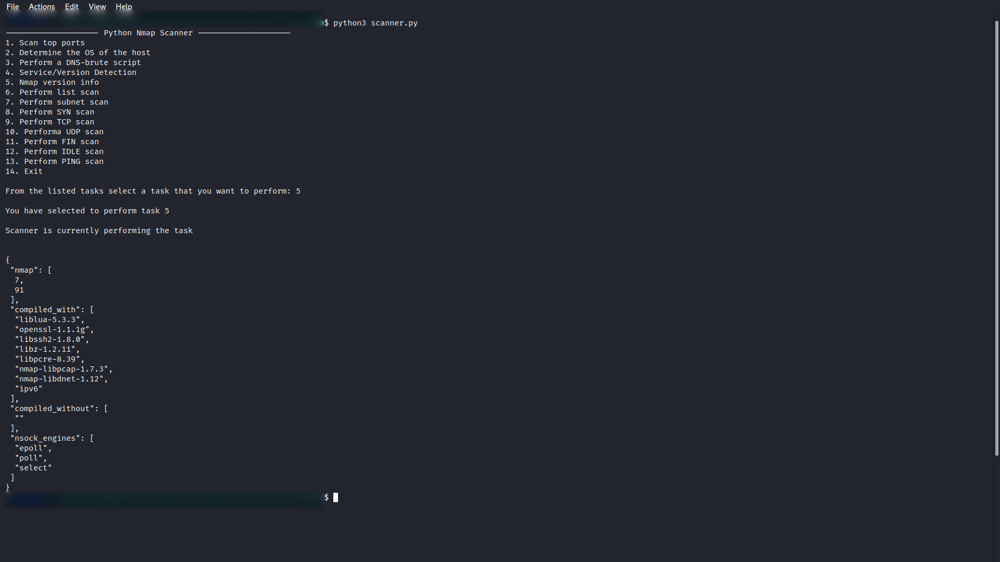

# <b>Python Nmap</b>

## Python Nmap : 🚀

Using nmap manually can be a pain. Luckily, we have got python to do that. In this script,
I have simplified using nmap in Python using python3-nmap library.

## Python Nmap Instructions: 👨🏻‍💻

### Step 1:

    Open Termnial 💻

### Step 2:

    Move to the directory: Python-Nmap/

### Step 3:

    Install the required packages using the the command:

    1. pip3 install -r requirements.txt
    2. sudo apt-get install nmap

### Step 4:

    Now to run the script, run the command:

    python3 scanner.py

    Now you will be displayed with choices for various scans.
    Chose the one that fits your purpose.

    Enter the IP-ADDRESS/DOMAIN-NAME accordingly.

### Step 5:

    Sit back and Relax. Let the Script do the Job. ☕
    The results of the scan will be displayed.

### Caution:

    Use at your own risk.

### Screenshots of Output

