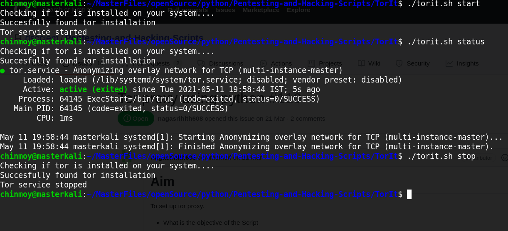

# Tor Utility script (TorIT)

A tor utility script to setup and use tor.

## Setp 1

Open Terminal

## Step 2

Traverse to the script location

## Step 3

Give executable permission to the script:

`chmod +x torit.sh`

## Step 4

Run the script as:

```bash
./torit.py start
./torit.py stop
./torit.py restart
./torit.py status
```

## Usage Details

Here is a list of all the features of TorIT.

- Install and setup tor if it's not installed on your system
- Start tor
- Stop tor
- Restart tor
- Check status

## Example Image


