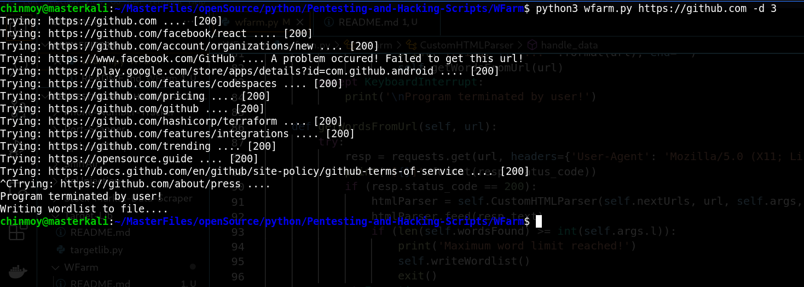

# Wordlist Generator from URL (WFarm)

A script that is capable of spidering urls to filter out words and generate a wordlist.

## Setp 1

Open Terminal

## Step 2

Traverse to the script location

## Step 3

Run the script as:

`python3 wfarm.py [URL] -d 3 -l`

## Usage Details

```
usage: wfarm.py [-h] [-min MIN] [-max MAX] [-d D] [-t T] [-o O] [-c] [-l L] url

positional arguments:
  url         url to spider.

optional arguments:
  -h, --help  show this help message and exit
  -min MIN    minimum length of word. Default is 4.
  -max MAX    maximum length of word. Default is 10.
  -d D        depth of urls found on page to visit. Default is 2.
  -t T        number of threads to use. Default is 5.
  -o O        path of output file of wordlist.
  -c          include both upper and lower case.
  -l L        max limit of words to add to wordlist. Default is 200k
```

## Example Image


