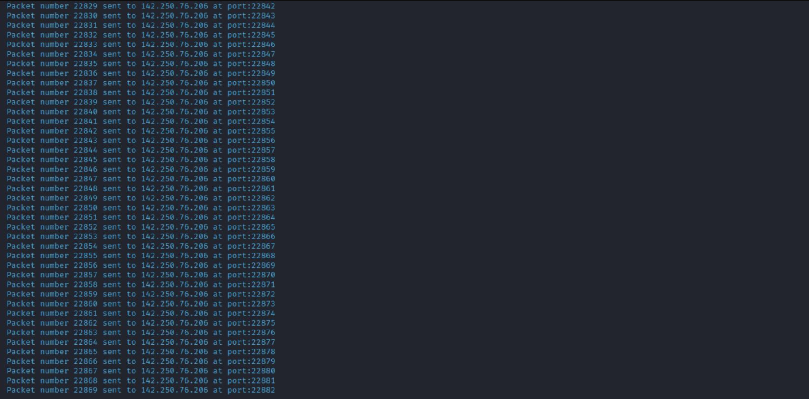

# Description

`This script is written in python3 and can be used to perform a DoS(Denial of Service) attack on a website. To run this script on your system, check if your system is supported or not(Supported systems are mentioned below). As you run the script, it asks you to provide the website's domain or IP address and the port number starting from which you want to send packets. Once the information is provided, the script will start sending packets to that domain starting from the port number provided. It will keep on sending resources to that site. Depending upon the website's capacaity to handle incoming packets, the script might overwhelm it and finally not make it work.`

### What is Dos Attack?

In a denial-of-service attack (DoS attack), the incoming traffic to a system originates from a single source(In this case your local computer). It might make the machine/resource unavailable to its intended users because of the heavy amount of incoming traffic.

### Supported Devices:

This program is supported in all operating system like Linux, Windows, etc. And, as the code is written in python3, it works well without bugs.

## Instructions for this python script to work : 👨🏻‍💻

### Step 1:

    Open Termnial 💻

### Step 2:

    Locate to the directory where its python file is located 📂

### Step 3:

    Run the command: python3 dos.py 🧐

### Step 4:

    Give the Domain name or IP address and port number and click enter 💥

### Step 5:

    Sit back and Relax. Let the Script do the Job. ☕

### Step 6:

    Click '3' or (ctrl + c) to quit else it will keep on sending packets 😅

## Screenshot

