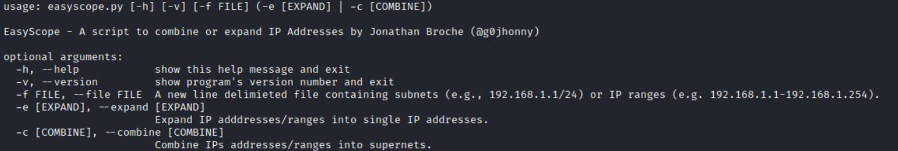
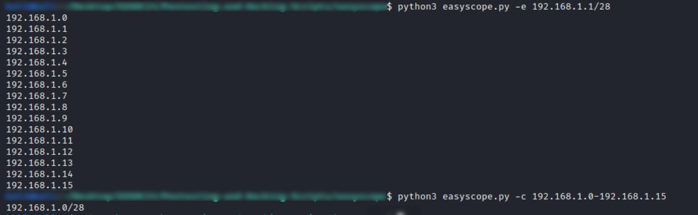

# EasyScope

This script will take an IP address range or a list of addresses/ranges and either expand them into single IPs or combine them into a supernet. Very useful for those abnormal scopes.

## Sample Input And Output

