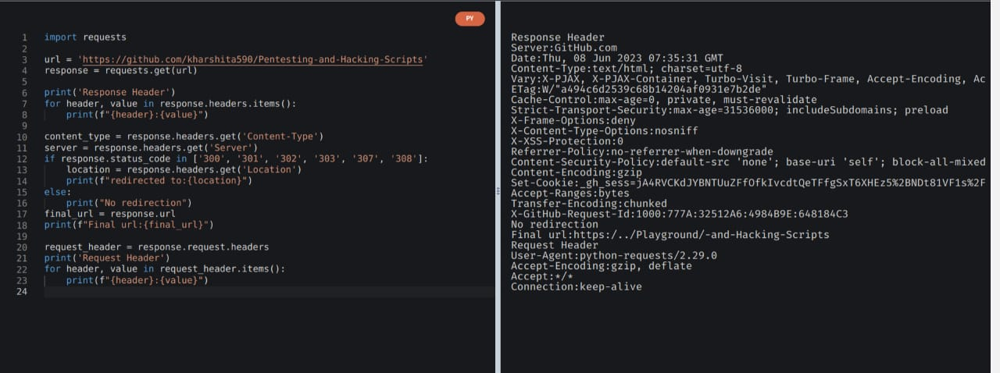

# Description

`This script is written in python3 and can be used to perform a header analysis on any type of link , it will give content type,server,location.`

### Supported Devices:

This program is supported in all operating system like Linux, Windows, etc. And, as the code is written in python3, it works well without bugs.

## Instructions for this python script to work : 👨🏻‍💻

### Step 1:

    Open Termnial 💻

### Step 2:

    Locate to the directory where its python file is located 📂

### Step 3:

    In place of https://example.com , place your desired email.

### Step 5:

    Sit back and Relax. Let the Script do the Job. ☕

## Screenshot

