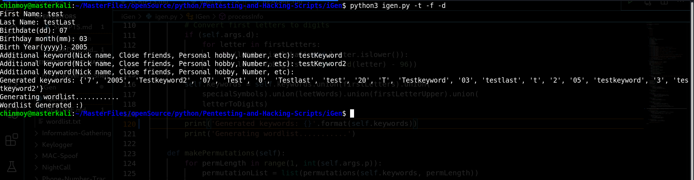

# Wordlist Generator (iGen)

A script to generate target specific wordlist based on personal information like name, birthdate, hobbies etc.

## Setp 1

Open Terminal

## Step 2

Traverse to the script location

## Step 3

Run the script as:

`python3 igen.py -t -d -f`

## Usage Details

The script maybe used with various flags based on which the script would generate the list.

```
usage: igen.py [-h] [-f] [-s] [-l] [-t] [-d] [-cs] [-p P] [-o O]

optional arguments:
  -h, --help  show this help message and exit
  -f          pick initials of keywords
  -s          add special sybmols(like @, _, etc)
  -l          enable leet sybmols
  -t          add keywords with capital initials
  -d          convert initials to digits
  -cs         generate all lowercase and uppercase variant of list
  -p P        permutation count (Warning: This exponentially increases the list size, if you have many options
              enabled or more number of keywords, keep this number small.A
              typical practical value would be 5-6). Default is 5.
  -o O        path to output file of wordlist.
```

## Example Image


